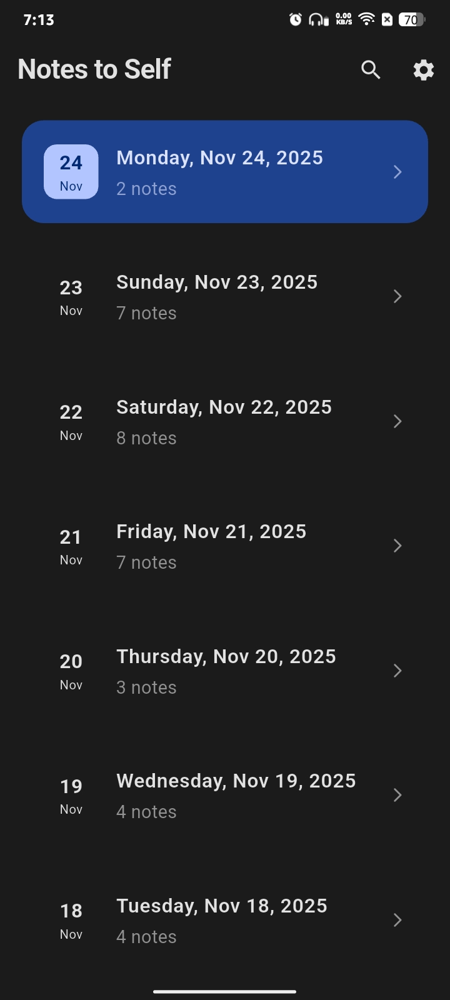
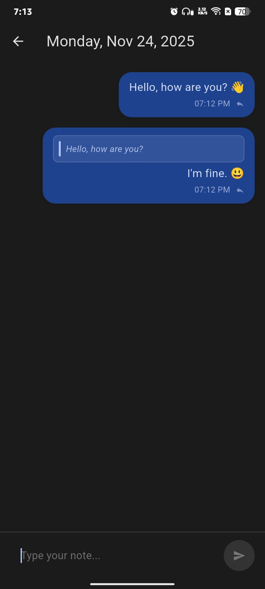
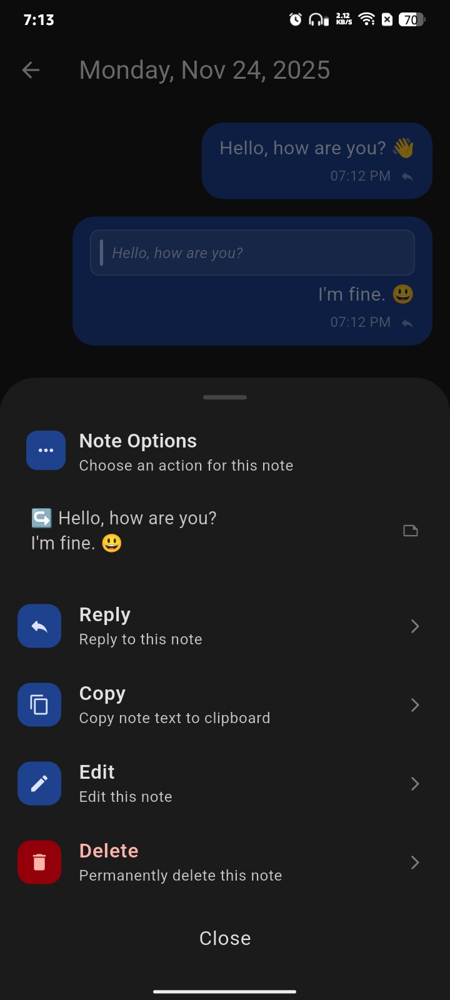
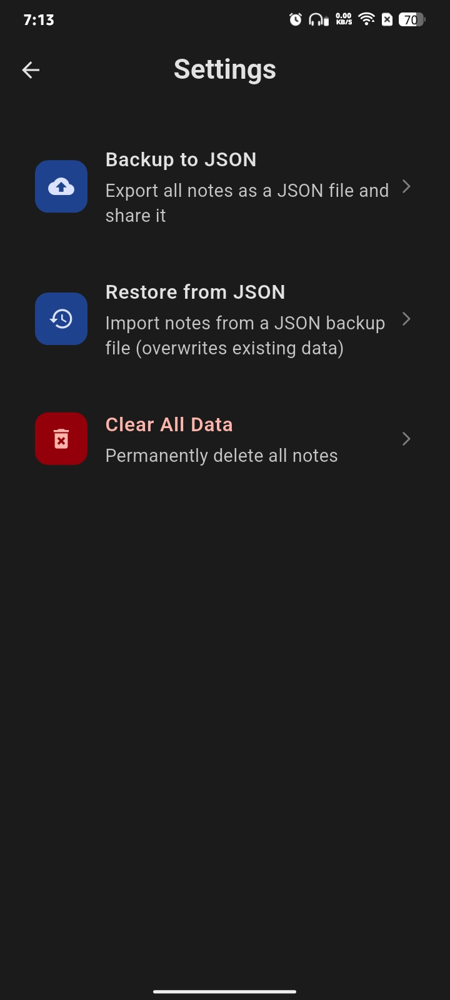
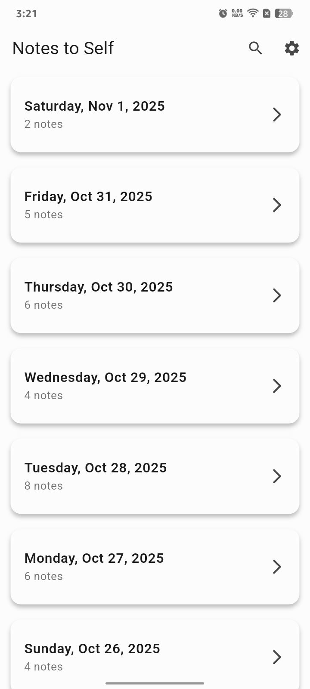
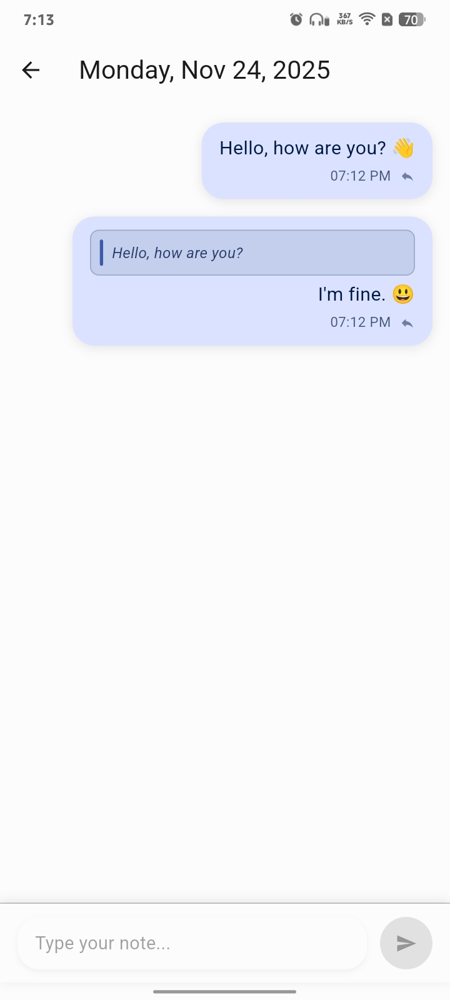
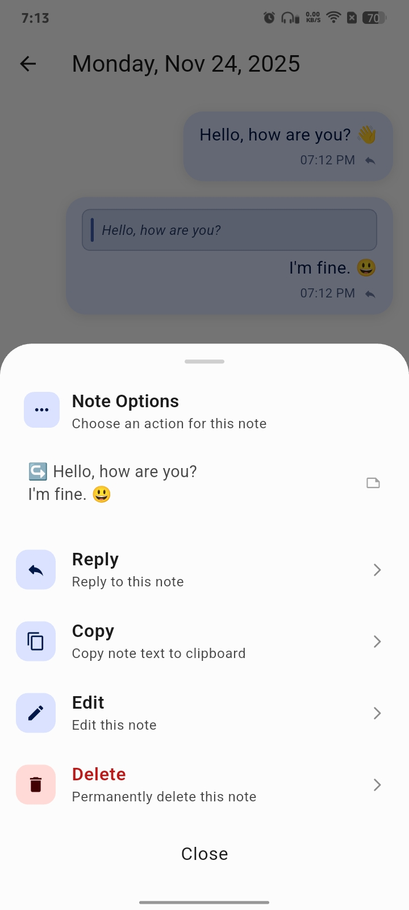
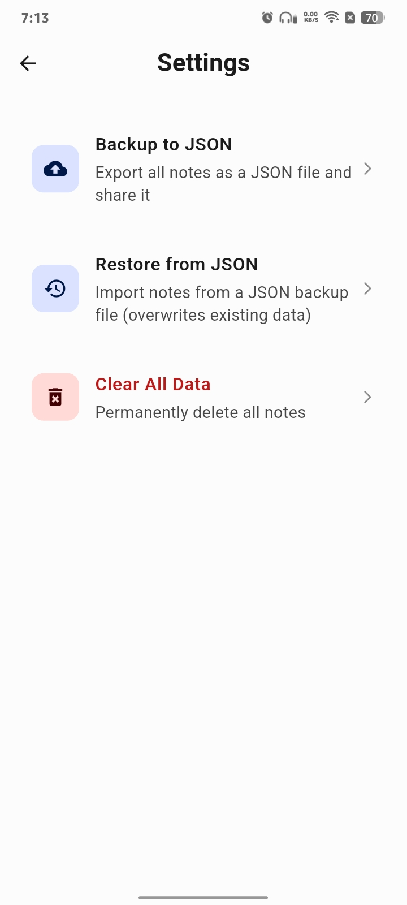

# 📝 NotesToSelf

  
  
  
  
  
  

---

### 🧠 Overview

**NotesToSelf** is a simple and modern note-taking app built with **Flutter** using **Material Design 3 (MD3)**.  
It helps you jot down thoughts, ideas, and reminders quickly — in a clean, private, and distraction-free way.  

I created this app because most note apps were either too complex or full of ads.  
This one keeps things light, private, and beautiful.

---

## ✨ Features

| Feature | Description |
|:--------|:-------------|
| 🧭 **Material You (MD3)** | Clean, adaptive, and responsive design |
| 🎨 **Dynamic color support** | Matches your system color (Android 12+) |
| 🌙 **Auto light/dark theme** | Adjusts automatically to system theme |
| 🗓️ **Notes by day** | Organized neatly by date |
| 🔍 **Instant search** | Quickly find your notes |
| 💾 **Backup & restore** | Save or restore your notes easily |
| ⚡ **Offline-first** | No login, no tracking, no ads |

---

## 📸 Screenshots

### 🌙 Dark Theme

  
  
  
  

---

### ☀️ Light Theme

  
  
  
  

---

## 💡 Contributing

Pull requests and feedback are always welcome.  
If you find a bug or have a suggestion, please open an issue with details.  

---

## ⭐ Support

If you find **Note to self** useful, please **star ⭐**.

---

## 📜 License

Licensed under the **GNU General Public License v3.0 (GPLv3)**.  
See [LICENSE](LICENSE) for details.
